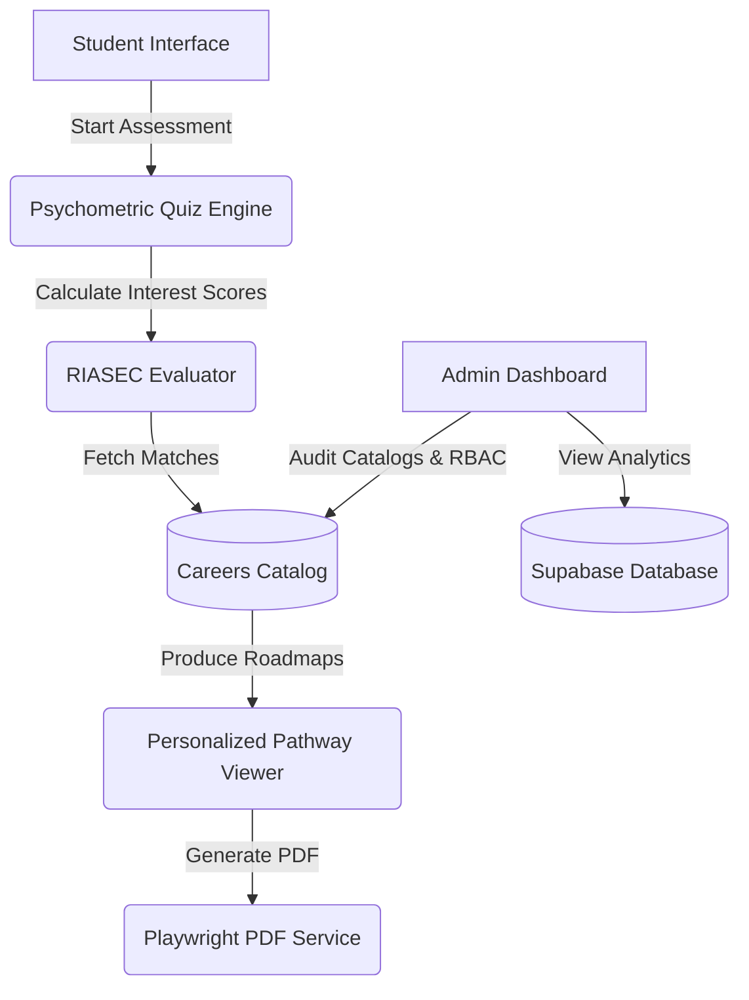

# Zertainity

Zertainity is a career-guidance platform for Indian students in Classes 10–12. It maps subjects, interests, and performance to exams, colleges, and career pathways.

## Architecture



## Core Capabilities

- Career assessments mapped to real-world pathways
- Detailed roadmaps from school to career milestones
- Careers and exams catalog for India
- College index with course and cutoff data
- Admin control panel with RBAC and analytics

## Technology Stack

| Layer | Technologies |
| :--- | :--- |
| Frontend | React 18, Vite, TypeScript |
| Styling | Tailwind CSS, shadcn/ui (Radix UI) |
| State | TanStack React Query (v5) |
| Database & Auth | Supabase (PostgreSQL, Edge Functions, Row Level Security) |
| PDF Generation | Playwright, WeasyPrint |

## Getting Started

### Prerequisites

- Node.js ≥ 18
- npm ≥ 9

### Local Setup

1. Clone the repository:
   ```bash
   git clone https://github.com/rdp12356/zertainity
   cd zertainity
   ```
2. Install dependencies:
   ```bash
   npm install
   ```
3. Create your environment file:
   ```bash
   cp .env.example .env
   ```
4. Start the dev server:
   ```bash
   npm run dev
   ```
   The app runs at http://localhost:5173.

## Maintainers

- Johan Manoj — Founder & Lead Developer (https://github.com/rdp12356)
- Viney Ragesh — Co-Developer / Contributor (https://github.com/vineyragesh333)

## Documentation

- AGENTS.md
- DESIGN.md
- CONTRIBUTING.md
- CODE_OF_CONDUCT.md
- SECURITY.md
- docs/directory_tree.md
- docs/unused_files.md

## License

MIT License © 2026 Zertainity
