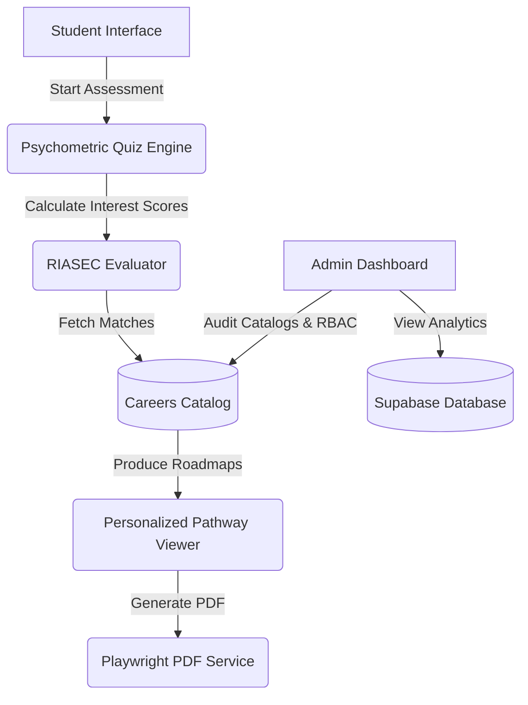

<div align="center">
  
# 🎓 Zertainity

**An intelligent, AI-powered student career-guidance platform built for Indian Class 10th and 12th students.** <br />
*Discover, navigate, and solidify educational pathways with confidence and clarity.*

[](https://vitejs.dev/)
[](https://react.dev/)
[](https://www.typescriptlang.org/)
[](https://supabase.com/)

</div>

---

## 🏛️ Platform Architecture

Zertainity operates on a highly robust architecture designed to evaluate students, parse extensive catalog data, and output personalized pathways.



---

## ✨ Core Features

*   **🧠 AI-Powered Career Assessments**: Dynamic, structured quizzes mapping student RIASEC interest profiles directly to real-world career paths.
*   **🛣️ Detailed Career Roadmaps**: Step-by-step educational routes mapping secondary school choices to college degrees and professional roles.
*   **📚 Careers & Exams Catalog**: A single source of truth containing 150+ actively monitored career tracks and competitive exams in India.
*   **🏫 Integrated College Index**: Detailed institutional listings mapping universities, courses, and cutoffs.
*   **🛡️ Advanced Admin Dashboard**: Secure role-based access control (RBAC) panel for auditing data sources, content operations, and analytics.

---

## 🛠️ Technology Stack

| Layer | Technologies |
| :--- | :--- |
| **Frontend** | React 18, Vite, TypeScript |
| **Styling** | Tailwind CSS, shadcn/ui (Radix UI), Framer Motion |
| **State Management** | TanStack React Query (v5) |
| **Backend & Auth** | Supabase (PostgreSQL, Edge Functions, RLS) |
| **PDF Generation** | Playwright, WeasyPrint |

---

## 🚀 Getting Started

### Prerequisites
*   **Node.js** ≥ 18
*   **npm** ≥ 9

### Local Installation

1.  **Clone the Repository**:
    ```bash
    git clone https://github.com/rdp12356/zertainity.git
    cd zertainity
    ```

2.  **Install Project Dependencies**:
    ```bash
    npm install
    ```

3.  **Configure Environment Parameters**:
    Copy the sample environment file and insert your publishable Supabase credentials:
    ```bash
    cp .env.example .env
    ```

4.  **Launch Vite Dev Server**:
    ```bash
    npm run dev
    ```
    The application will be accessible at [http://localhost:5173](http://localhost:5173).

---

## 👨‍💻 Maintainers & Foundational Developers

*   **Johan Manoj** — *Founder & Lead Developer* ([rdp12356](https://github.com/rdp12356))
*   **Viney Ragesh** — *Co-Developer / Contributor* ([vineyragesh333](https://github.com/vineyragesh333))

---

## 📄 Repository Documentation Links

> [!IMPORTANT]
> Please review our guidelines and standards before editing source code or proposing changes.

*   📖 **[AGENTS.md](./AGENTS.md)**: Workspace configuration and rules for AI assistants.
*   📖 **[DESIGN.md](./DESIGN.md)**: Visual identity guidelines and design system specifications.
*   📖 **[CONTRIBUTING.md](./CONTRIBUTING.md)**: Contribution guidelines and local testing setup.
*   📖 **[CODE_OF_CONDUCT.md](./CODE_OF_CONDUCT.md)**: Community rules and standard pledges.
*   📖 **[SECURITY.md](./SECURITY.md)**: Vulnerability disclosure policies.

---

<div align="center">
  <i>MIT License © 2026 Zertainity</i>
</div>
